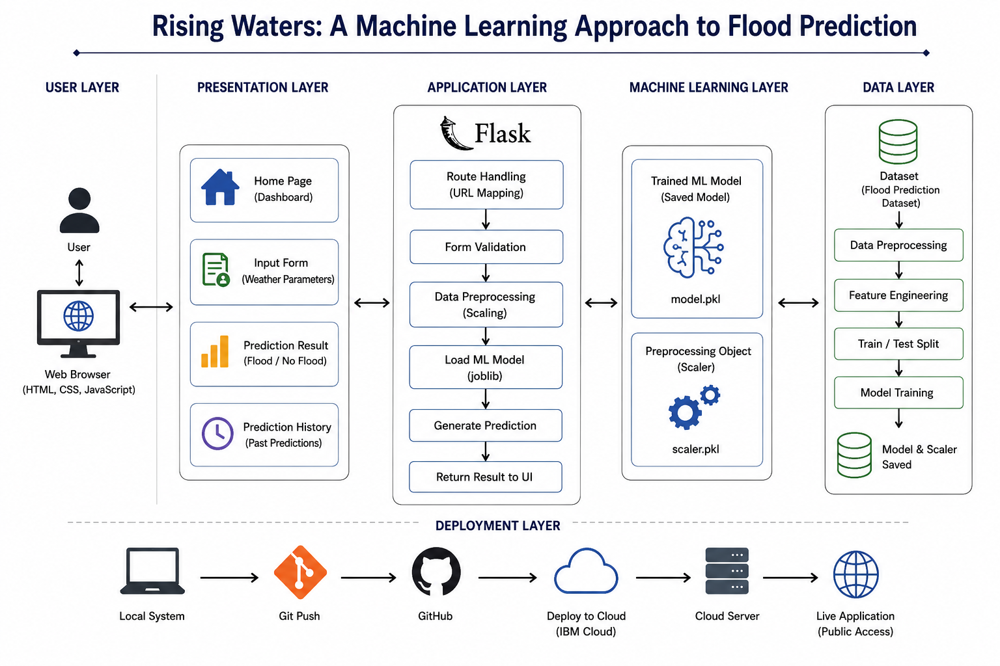

# 🌊 Rising Waters: Machine Learning-Based Flood Prediction System

A Machine Learning-based web application that predicts flood occurrence using historical weather and rainfall parameters. The project covers the full ML lifecycle — data preprocessing, model training, evaluation, model serialization, and deployment through a Flask web app.

🔗 **Live App:** [https://risingwaters-1.onrender.com/](https://risingwaters-1.onrender.com/)

---

# 🏗️ System Architecture

<p align="center">
  
</p>

---

# 📖 Project Overview

Floods are among the most destructive natural disasters, causing significant damage to life and property. Predicting flood occurrence in advance can help authorities and communities take preventive measures.

This project uses historical weather and rainfall data to train a machine learning classification model that predicts whether a flood is likely, based on 10 meteorological and rainfall parameters. The trained model and its scaler are serialized with Joblib and served through a Flask app, where users enter readings through a web form and get an instant prediction.

---

# 🚀 Features

- Flood prediction from 10 weather/rainfall inputs
- Flask backend with a trained scikit-learn model + scaler (`floods.save`, `transform.save`)
- Result pages with an animated risk gauge (high/low risk)
- Light/dark theme toggle, saved across visits
- Ambient rain and lightning animation on canvas
- Responsive layout for mobile and desktop

---

# 🛠️ Technologies Used

## Programming Language
- Python

## Machine Learning Libraries
- NumPy
- Pandas
- Matplotlib
- Seaborn
- Scikit-learn
- Joblib

## Web Technologies
- Flask
- HTML5
- CSS3
- JavaScript (vanilla, no frameworks)

## Development Tools
- Jupyter Notebook
- Visual Studio Code
- Git
- GitHub

---

# 📁 Submission Folder Structure

This project is submitted as part of the AI-ML and GEN-AI Track, which requires deliverables organized into eight phase folders:

```
1.Brainstorming & Ideation
2.Requirement Analysis
3.Project Design Phase
4.Project Planning Phase
5. Project Development Phase
6.Project Testing
7.Project Documentation
8.Project Demonstration
```

All runnable project files live inside a `Source Code` folder nested under `5. Project Development Phase`:

```
5. Project Development Phase/
└── Source Code/
    ├── app.py
    ├── requirements.txt
    ├── Procfile
    ├── train_model.py
    ├── floods.save
    ├── transform.save
    ├── architecture.png
    ├── README.md
    ├── .gitignore
    │
    ├── dataset/
    │   └── flood dataset.xlsx
    │
    ├── templates/
    │   ├── home.html
    │   ├── predict.html
    │   ├── chance.html
    │   └── no_chance.html
    │
    ├── static/
    │   ├── main.css
    │   ├── main.js
    │   └── hero-rain.png
    │
    └── screenshots/
```

**Not included in `Source Code`** (excluded from submission):
- `venv`
- `retrain_env`
- `__pycache__`
- `.git`

All setup and run instructions below assume you are working from inside `5. Project Development Phase/Source Code`.

---

# 📊 Dataset

The dataset consists of historical rainfall and weather measurements used for flood classification.

## Input Features (used by the deployed model)

1. Temperature
2. Humidity
3. Cloud Cover
4. Annual Rainfall
5. Jan-Feb Rainfall
6. Mar-May Rainfall
7. Jun-Sep Rainfall
8. Oct-Dec Rainfall
9. Average June Rainfall
10. Subdivision Rainfall

## Target Variable

Flood
- **0 → No Flood**
- **1 → Flood**

---

# 🔄 Machine Learning Workflow

```
Dataset
   │
   ▼
Data Collection
   │
   ▼
Exploratory Data Analysis
   │
   ▼
Data Preprocessing & Missing Value Handling
   │
   ▼
Outlier Detection
   │
   ▼
Feature Scaling
   │
   ▼
Train-Test Split
   │
   ▼
Model Training & Evaluation (train_model.py)
   │
   ▼
Best Model Selection
   │
   ▼
Model + Scaler Saved with Joblib
   │
   ▼
Flask Deployment
   │
   ▼
Flood Prediction
```

---

# 📈 Model Evaluation

Models were compared using standard classification metrics:
- Accuracy Score
- Confusion Matrix
- Precision
- Recall
- F1-Score
- Classification Report

The best-performing model was selected and saved as `floods.save`, with its corresponding feature scaler saved as `transform.save`.

---

# 🌐 Web Application

## Routes

| Route | Method | Renders |
|---|---|---|
| `/` | GET | `home.html` — landing page with project intro |
| `/predict` | GET | `predict.html` — input form for the 10 weather/rainfall readings |
| `/predict` | POST | `chance.html` or `no_chance.html` — prediction result |

## Pages

**Home Page** — introduces the project, links to the prediction form.

**Prediction Page** — form collecting all 10 model inputs (Temperature, Humidity, Cloud Cover, Annual/Jan-Feb/Mar-May/Jun-Sep/Oct-Dec/Average June Rainfall, Subdivision Rainfall).

**Prediction Result** — shows either:
- ⚠️ Flood Predicted (high risk gauge)
- ✅ No Flood Predicted (low risk gauge)

---

# ⚙️ Installation

## Clone Repository
```bash
git clone https://github.com/Laharisrikotipalli/RisingWaters.git
```

## Navigate to the Source Code Folder
```bash
cd "RisingWaters/5. Project Development Phase/Source Code"
```
(If you're running this project on its own, outside the full submission structure, just `cd` into wherever `app.py` lives.)

## Install Dependencies
```bash
pip install -r requirements.txt
```

## (Optional) Retrain the Model
```bash
python train_model.py
```
This regenerates `floods.save` and `transform.save` from `dataset/flood dataset.xlsx`. Skip this step if you're using the pre-trained model files already included.

## Run Application
```bash
python app.py
```

## Open Browser
```
http://127.0.0.1:5000
```

---

# 📋 Requirements

```
Flask
NumPy
Pandas
Scikit-learn
Joblib
Gunicorn
```

Or simply run:
```bash
pip install -r requirements.txt
```

---

# 💡 Future Enhancements

- Real-Time Weather API Integration
- River Water Level Monitoring
- Dam Water Level Analysis
- Satellite Data Integration
- Live Rainfall Monitoring
- Cloud Deployment
- Mobile Application
- Deep Learning-Based Flood Forecasting
- Time-Series Prediction Models

---

# 📚 Learning Outcomes

This project helped in understanding:
- Data Collection & Exploratory Data Analysis
- Feature Engineering & Preprocessing
- Machine Learning Classification
- Model Evaluation & Serialization
- Flask Web Development
- Deployment of Machine Learning Models
- Git and GitHub Version Control

---

# 📖 References

- Kaggle Flood Prediction Dataset
- Scikit-learn Documentation
- Flask Documentation
- Pandas Documentation
- NumPy Documentation

---

# 👩‍💻 Author

**Lahari Sri Kotipalli**
B.Tech – Computer Science and Engineering
